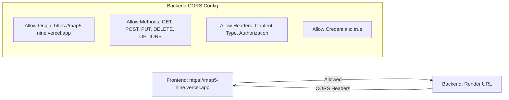

# Design Document

## Overview

The frontend application deployed on Vercel cannot connect to the backend API deployed on Render due to CORS (Cross-Origin Resource Sharing) policy blocking requests. This design outlines the solution to enable proper communication between the frontend and backend services.

## Architecture

### Current Problem


### Solution Architecture



## Components and Interfaces

### Backend CORS Configuration

The backend needs to be configured with proper CORS middleware to allow requests from the Vercel frontend.

```typescript
interface CORSConfig {
  origin: string | string[]
  methods: string[]
  allowedHeaders: string[]
  credentials: boolean
}
```

### Environment Configuration

Both frontend and backend need consistent environment variables for API endpoints.

```typescript
// Backend Environment
interface BackendEnv {
  FRONTEND_URL: string
  PORT: string
  NODE_ENV: string
}

// Frontend Environment
interface FrontendEnv {
  VITE_API_URL: string
  VITE_NODE_ENV: string
}
```

## Implementation Details

### Backend Changes Required

1. **CORS Middleware Configuration**
   - Install and configure `cors` package
   - Set allowed origins to include Vercel frontend URL
   - Enable credentials for authentication cookies/headers

2. **Environment Variables**
   - Add `FRONTEND_URL` environment variable
   - Ensure `PORT` is properly configured for Render

3. **Authentication Headers**
   - Ensure JWT tokens are properly handled in CORS preflight requests
   - Configure proper response headers for authentication

### Frontend Changes Required

1. **API Base URL Configuration**
   - Ensure `VITE_API_URL` points to correct Render backend URL
   - Handle different URLs for development vs production

2. **Request Configuration**
   - Ensure requests include proper headers
   - Configure credentials handling for authentication

### Deployment Configuration

1. **Render Backend**
   - Verify service name matches expected URL
   - Configure environment variables properly
   - Ensure health check endpoints work

2. **Vercel Frontend**
   - Verify build environment variables
   - Ensure production build uses correct API URL

## Error Handling

### CORS Error Detection
- Implement proper error handling for CORS-related failures
- Provide clear error messages for connectivity issues
- Add retry logic for network failures

### Authentication Error Handling
- Handle authentication failures gracefully
- Redirect to login on authentication errors
- Clear invalid tokens on CORS failures

## Testing Strategy

### Manual Testing
- Test login from deployed frontend to deployed backend
- Verify all API endpoints work with CORS configuration
- Test preflight OPTIONS requests

### Automated Testing
- Add integration tests for CORS configuration
- Test authentication flow end-to-end
- Verify environment variable configuration

## Security Considerations

### CORS Security
- Restrict origins to only necessary domains
- Avoid wildcard origins in production
- Properly configure credentials handling

### Environment Security
- Secure environment variable storage
- Use HTTPS for all production communications
- Validate all environment configurations

## Deployment Verification

### Checklist
- [ ] Backend CORS allows frontend origin
- [ ] Frontend API URL points to backend
- [ ] Authentication flow works end-to-end
- [ ] All environment variables configured
- [ ] Health checks pass on both services