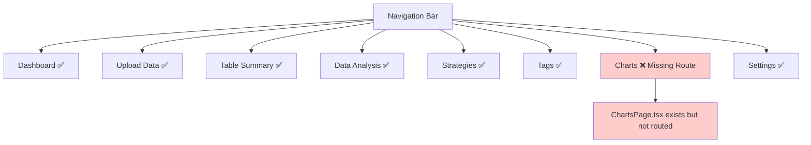
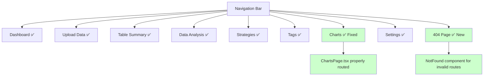

# Design Document

## Overview

The navigation fix addresses routing issues, missing pages, and broken navigation links in the TradeInsight MVP application. The solution ensures all navigation links work properly, adds missing routes, and provides consistent navigation behavior across the application.

## Architecture

### Current Navigation Issues



### Fixed Navigation Architecture



## Components and Interfaces

### Navigation Components

#### AppLayout Navigation
The main navigation component that needs updates:
- Add Charts link to navigation array
- Ensure proper active state highlighting
- Handle navigation errors gracefully

#### Route Configuration
Update App.tsx routing to include:
- Charts page route
- 404 Not Found route
- Proper error boundaries for route failures

### Missing Components

#### Charts Route
- Add `/charts` route to App.tsx
- Import and configure ChartsPage component
- Ensure proper lazy loading if needed

#### 404 Not Found Page
- Create NotFound component for invalid routes
- Provide helpful navigation back to valid pages
- Maintain consistent layout and styling

### Error Handling Components

#### Route Error Boundary
- Catch routing errors and display helpful messages
- Provide recovery options for users
- Log errors for debugging

#### Navigation Error States
- Handle component loading failures
- Provide fallback UI for broken navigation
- Ensure graceful degradation

## Implementation Details

### Navigation Updates

1. **Add Charts to Navigation Array**
   ```typescript
   const navigation = [
     { name: 'Dashboard', href: '/dashboard', icon: HomeIcon },
     { name: 'Upload Data', href: '/upload', icon: DocumentArrowUpIcon },
     { name: 'Table Summary', href: '/table-summary', icon: TableCellsIcon },
     { name: 'Data Analysis', href: '/data', icon: ChartBarIcon },
     { name: 'Charts', href: '/charts', icon: ChartBarIcon }, // NEW
     { name: 'Strategies', href: '/strategies', icon: FolderIcon },
     { name: 'Tags', href: '/tags', icon: TagIcon },
   ];
   ```

2. **Add Charts Route**
   ```typescript
   <Route 
     path="/charts" 
     element={
       <ProtectedRoute>
         <AppLayout>
           <ChartsPage />
         </AppLayout>
       </ProtectedRoute>
     } 
   />
   ```

3. **Add 404 Route**
   ```typescript
   <Route path="*" element={<NotFound />} />
   ```

### Component Structure

#### ChartsPage Integration
- Ensure ChartsPage is properly exported
- Add necessary imports to App.tsx
- Configure lazy loading if component is large

#### NotFound Component
```typescript
interface NotFoundProps {
  message?: string;
  showNavigation?: boolean;
}

export const NotFound: React.FC<NotFoundProps> = ({
  message = "Page not found",
  showNavigation = true
}) => {
  // Component implementation
}
```

### Error Handling Strategy

#### Route-Level Error Boundaries
- Wrap each route with error boundary
- Provide specific error messages for different failure types
- Allow users to retry or navigate away

#### Navigation State Management
- Track navigation state for better error recovery
- Provide breadcrumb navigation for complex routes
- Handle browser back/forward button properly

## Testing Strategy

### Navigation Testing
- Test all navigation links work correctly
- Verify active state highlighting
- Test navigation with different user states (authenticated/unauthenticated)

### Route Testing
- Test all defined routes load correctly
- Test 404 handling for invalid routes
- Test protected route authentication

### Error Handling Testing
- Test component loading failures
- Test network failures during navigation
- Test browser navigation (back/forward buttons)

## Security Considerations

### Route Protection
- Ensure all protected routes require authentication
- Verify user permissions for sensitive pages
- Handle authentication failures gracefully

### Error Information Disclosure
- Avoid exposing sensitive information in error messages
- Log detailed errors server-side only
- Provide user-friendly error messages

## Performance Considerations

### Lazy Loading
- Implement lazy loading for heavy components
- Provide loading states during component loading
- Optimize bundle splitting for better performance

### Navigation Performance
- Minimize re-renders during navigation
- Cache navigation state where appropriate
- Optimize route matching performance

## Accessibility Considerations

### Navigation Accessibility
- Ensure proper ARIA labels for navigation
- Support keyboard navigation
- Provide screen reader friendly navigation

### Error Message Accessibility
- Ensure error messages are announced to screen readers
- Provide clear instructions for error recovery
- Maintain focus management during errors