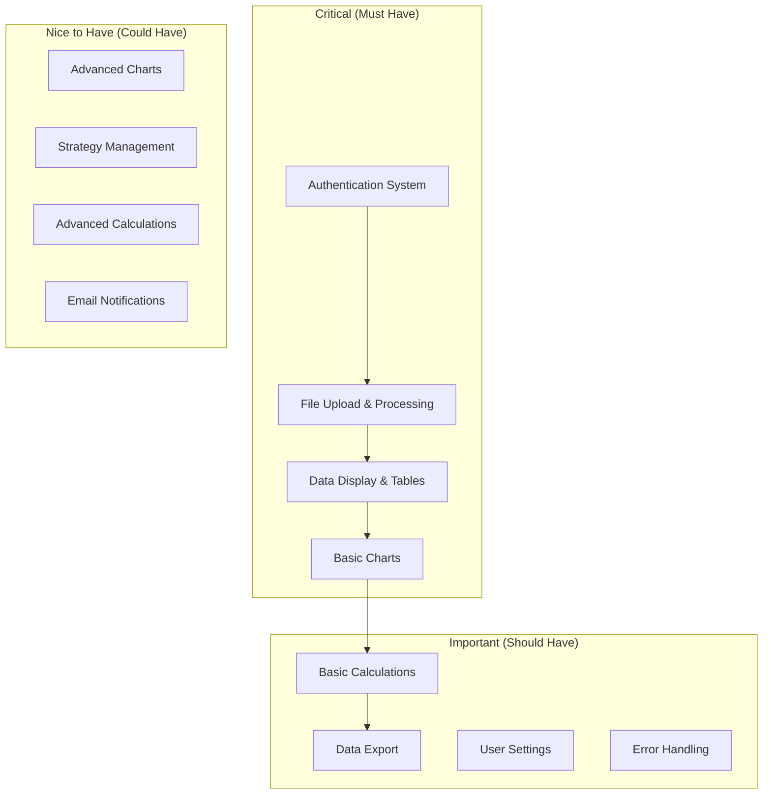
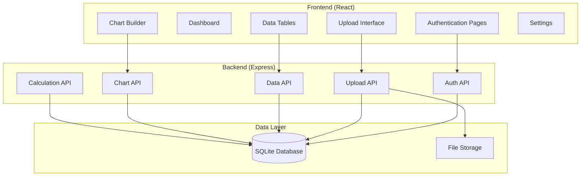

# Design Document

## Overview

The MVP completion design focuses on delivering a functional, stable trading data analysis application with core features working reliably. This design prioritizes essential functionality over advanced features, ensuring a solid foundation that can be enhanced in future iterations.

## Architecture

### MVP Feature Priority

### System Architecture

## Implementation Strategy

### Phase 1: Core Stability (Immediate)
**Goal:** Ensure existing features work reliably

1. **Authentication Flow**
   - Fix any remaining login/registration issues
   - Ensure email verification works
   - Test session management

2. **File Upload System**
   - Verify 25MB limit works correctly
   - Test CSV parsing with various formats
   - Ensure error handling is robust

3. **Data Display**
   - Test table functionality with real data
   - Verify pagination and sorting work
   - Ensure responsive design

### Phase 2: Essential Features (Next)
**Goal:** Complete core MVP functionality

1. **Chart System**
   - Ensure chart creation works
   - Test with different data types
   - Add basic chart export

2. **Basic Calculations**
   - Verify formula validation
   - Test calculation execution
   - Ensure results are saved correctly

3. **User Experience**
   - Add loading states
   - Improve error messages
   - Test mobile responsiveness

### Phase 3: Polish & Deploy (Final)
**Goal:** Production-ready application

1. **Performance Optimization**
   - Optimize database queries
   - Add caching where appropriate
   - Minimize bundle size

2. **Error Handling**
   - Comprehensive error boundaries
   - User-friendly error messages
   - Proper logging

3. **Deployment**
   - Production environment setup
   - Database migrations
   - Health checks

## Component Design

### Authentication System
- **Status:** Mostly complete, needs testing
- **Priority:** Critical
- **Tasks:** Test email verification, session handling

### File Upload System
- **Status:** Complete with 25MB limit
- **Priority:** Critical
- **Tasks:** Test edge cases, error handling

### Data Tables
- **Status:** Implemented, needs testing
- **Priority:** Critical
- **Tasks:** Test with large datasets, verify performance

### Chart System
- **Status:** Partially implemented
- **Priority:** Important
- **Tasks:** Complete chart builder, test chart types

### Calculation Engine
- **Status:** Basic implementation exists
- **Priority:** Important
- **Tasks:** Test formula validation, error handling

### Strategy Management
- **Status:** Implemented but complex
- **Priority:** Nice to have
- **Tasks:** Simplify or defer to v2

## Testing Strategy

### Manual Testing Priority
1. **Authentication flow** - Register, verify, login, logout
2. **File upload** - Various CSV formats, size limits
3. **Data display** - Large datasets, sorting, filtering
4. **Chart creation** - Different chart types, data columns
5. **Basic calculations** - Formula creation, validation

### Automated Testing
- Focus on critical paths
- API endpoint testing
- Component integration testing

## Performance Considerations

### Database Optimization
- Ensure proper indexes exist
- Optimize common queries
- Monitor query performance

### Frontend Performance
- Lazy load heavy components
- Optimize bundle size
- Add loading states

### Memory Management
- Handle large file uploads efficiently
- Clean up unused data
- Monitor memory usage

## Security Considerations

### Data Protection
- Secure file upload handling
- Proper input validation
- SQL injection prevention

### Authentication Security
- Secure JWT handling
- Password security
- Session management

## Deployment Strategy

### Environment Setup
- Production environment variables
- Database initialization
- Health check endpoints

### Monitoring
- Basic error logging
- Performance monitoring
- Uptime monitoring

## Success Criteria

### MVP is considered complete when:
1. ✅ Users can register and login reliably
2. ✅ Users can upload CSV files up to 25MB
3. ✅ Users can view their data in sortable tables
4. ✅ Users can create basic charts from their data
5. ✅ Users can perform simple calculations
6. ✅ Application is deployed and accessible
7. ✅ Core functionality works without major bugs
8. ✅ Error handling provides helpful feedback

### Out of Scope for MVP:
- Advanced strategy management
- Complex calculation formulas
- Advanced chart customization
- Email notifications
- Advanced user management
- Performance analytics
- Mobile app
- API documentation
- Advanced security features