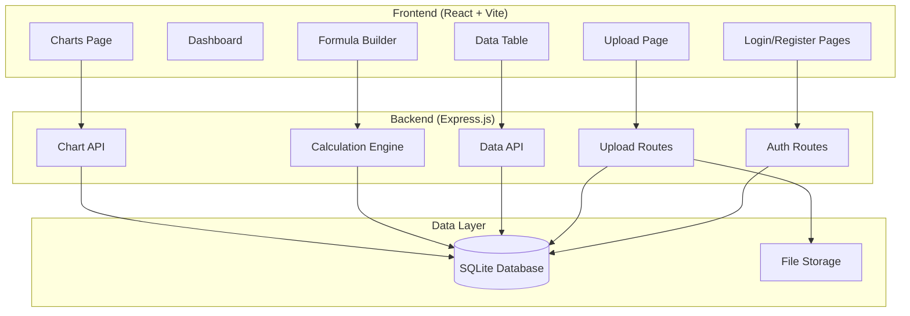
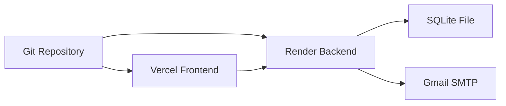

# Design Document

## Overview

TradeInsight MVP is designed as a monolithic web application with a React frontend and Express.js backend, optimized for rapid development and cost-effective deployment. The architecture prioritizes simplicity and reliability over scalability, using SQLite for data persistence and targeting free hosting tiers.

## Architecture

### High-Level Architecture



### Deployment Architecture



## Components and Interfaces

### Frontend Components

#### Authentication Components
- **LoginForm**: Email/password form with validation
- **RegisterForm**: Registration with email verification flow
- **AuthProvider**: Context provider for authentication state
- **ProtectedRoute**: Route wrapper for authenticated pages

#### Data Management Components
- **FileUpload**: CSV file selection and upload with progress
- **DataTable**: Sortable, filterable table using TanStack Table
- **ColumnToggle**: Show/hide column controls
- **Pagination**: Page navigation for large datasets

#### Calculation Components
- **FormulaBuilder**: Formula input with syntax highlighting
- **CalcPreview**: Live preview of calculated values
- **ColumnManager**: Manage calculated columns

#### Visualization Components
- **LineChart**: Time series visualization using Chart.js
- **BarChart**: Categorical data visualization
- **ChartControls**: Axis selection and chart type toggle

#### Strategy Management Components
- **StrategyForm**: Create and edit trading strategies
- **StrategyList**: Display all user strategies with filtering
- **BucketManager**: Create and manage strategy buckets/categories
- **TagManager**: Create and assign tags to strategies
- **StrategyAnalytics**: Performance metrics for strategies

#### Layout Components
- **Dashboard**: Main navigation and statistics
- **NavMenu**: Consistent navigation across pages
- **StatsDisplay**: User data statistics

### Backend Services

#### Authentication Service
```typescript
interface AuthService {
  register(email: string, password: string): Promise<User>
  login(email: string, password: string): Promise<AuthResult>
  verifyEmail(token: string): Promise<boolean>
  generateJWT(userId: number): string
  verifyJWT(token: string): Promise<User>
}
```

#### CSV Processing Service
```typescript
interface CSVService {
  parseFile(file: Buffer): Promise<ParsedData>
  validateStructure(data: any[]): ValidationResult
  storeData(userId: number, data: any[]): Promise<StorageResult>
}
```

#### Data Query Service
```typescript
interface DataService {
  getUserData(userId: number, options: QueryOptions): Promise<DataResult>
  getColumnInfo(userId: number): Promise<ColumnInfo[]>
  applyFilters(data: any[], filters: Filter[]): any[]
}
```

#### Calculation Engine
```typescript
interface CalculationEngine {
  parseFormula(formula: string): ParsedFormula
  validateFormula(formula: string, columns: string[]): ValidationResult
  executeFormula(formula: ParsedFormula, data: any[]): number[]
  saveCalculatedColumn(userId: number, column: CalculatedColumn): Promise<void>
}
```

#### Strategy Management Service
```typescript
interface StrategyService {
  createStrategy(userId: number, strategy: CreateStrategyRequest): Promise<Strategy>
  updateStrategy(userId: number, strategyId: number, updates: UpdateStrategyRequest): Promise<Strategy>
  deleteStrategy(userId: number, strategyId: number): Promise<void>
  getUserStrategies(userId: number, options: QueryOptions): Promise<Strategy[]>
  getStrategyById(userId: number, strategyId: number): Promise<Strategy>
  assignStrategyToBucket(strategyId: number, bucketId: number): Promise<void>
  addTagsToStrategy(strategyId: number, tagIds: number[]): Promise<void>
}
```

#### Bucket Management Service
```typescript
interface BucketService {
  createBucket(userId: number, bucket: CreateBucketRequest): Promise<Bucket>
  updateBucket(userId: number, bucketId: number, updates: UpdateBucketRequest): Promise<Bucket>
  deleteBucket(userId: number, bucketId: number): Promise<void>
  getUserBuckets(userId: number): Promise<Bucket[]>
  getStrategiesInBucket(userId: number, bucketId: number): Promise<Strategy[]>
}
```

#### Tag Management Service
```typescript
interface TagService {
  createTag(userId: number, tag: CreateTagRequest): Promise<Tag>
  updateTag(userId: number, tagId: number, updates: UpdateTagRequest): Promise<Tag>
  deleteTag(userId: number, tagId: number): Promise<void>
  getUserTags(userId: number): Promise<Tag[]>
  getStrategiesByTag(userId: number, tagId: number): Promise<Strategy[]>
}
```

## Data Models

### Database Schema

```sql
-- Users table
CREATE TABLE users (
  id INTEGER PRIMARY KEY AUTOINCREMENT,
  email TEXT UNIQUE NOT NULL,
  password_hash TEXT NOT NULL,
  email_verified BOOLEAN DEFAULT FALSE,
  verification_token TEXT,
  created_at DATETIME DEFAULT CURRENT_TIMESTAMP,
  updated_at DATETIME DEFAULT CURRENT_TIMESTAMP
);

-- Data rows table (flexible JSON storage)
CREATE TABLE data_rows (
  id INTEGER PRIMARY KEY AUTOINCREMENT,
  user_id INTEGER NOT NULL,
  upload_id TEXT NOT NULL,
  row_index INTEGER NOT NULL,
  row_data TEXT NOT NULL, -- JSON string
  uploaded_at DATETIME DEFAULT CURRENT_TIMESTAMP,
  FOREIGN KEY (user_id) REFERENCES users(id)
);

-- Upload metadata
CREATE TABLE uploads (
  id TEXT PRIMARY KEY, -- UUID
  user_id INTEGER NOT NULL,
  filename TEXT NOT NULL,
  row_count INTEGER NOT NULL,
  column_names TEXT NOT NULL, -- JSON array
  uploaded_at DATETIME DEFAULT CURRENT_TIMESTAMP,
  FOREIGN KEY (user_id) REFERENCES users(id)
);

-- Calculated columns
CREATE TABLE calculated_columns (
  id INTEGER PRIMARY KEY AUTOINCREMENT,
  user_id INTEGER NOT NULL,
  upload_id TEXT NOT NULL,
  column_name TEXT NOT NULL,
  formula TEXT NOT NULL,
  created_at DATETIME DEFAULT CURRENT_TIMESTAMP,
  FOREIGN KEY (user_id) REFERENCES users(id),
  FOREIGN KEY (upload_id) REFERENCES uploads(id)
);

-- Strategy buckets/categories
CREATE TABLE strategy_buckets (
  id INTEGER PRIMARY KEY AUTOINCREMENT,
  user_id INTEGER NOT NULL,
  name TEXT NOT NULL,
  description TEXT,
  color TEXT, -- Hex color for UI
  created_at DATETIME DEFAULT CURRENT_TIMESTAMP,
  updated_at DATETIME DEFAULT CURRENT_TIMESTAMP,
  FOREIGN KEY (user_id) REFERENCES users(id)
);

-- Trading strategies
CREATE TABLE strategies (
  id INTEGER PRIMARY KEY AUTOINCREMENT,
  user_id INTEGER NOT NULL,
  bucket_id INTEGER,
  name TEXT NOT NULL,
  description TEXT,
  entry_rules TEXT, -- JSON string with entry conditions
  exit_rules TEXT, -- JSON string with exit conditions
  risk_management TEXT, -- JSON string with risk parameters
  notes TEXT,
  is_active BOOLEAN DEFAULT TRUE,
  created_at DATETIME DEFAULT CURRENT_TIMESTAMP,
  updated_at DATETIME DEFAULT CURRENT_TIMESTAMP,
  FOREIGN KEY (user_id) REFERENCES users(id),
  FOREIGN KEY (bucket_id) REFERENCES strategy_buckets(id)
);

-- Tags for strategies
CREATE TABLE tags (
  id INTEGER PRIMARY KEY AUTOINCREMENT,
  user_id INTEGER NOT NULL,
  name TEXT NOT NULL,
  color TEXT, -- Hex color for UI
  created_at DATETIME DEFAULT CURRENT_TIMESTAMP,
  FOREIGN KEY (user_id) REFERENCES users(id),
  UNIQUE(user_id, name)
);

-- Many-to-many relationship between strategies and tags
CREATE TABLE strategy_tags (
  strategy_id INTEGER NOT NULL,
  tag_id INTEGER NOT NULL,
  created_at DATETIME DEFAULT CURRENT_TIMESTAMP,
  PRIMARY KEY (strategy_id, tag_id),
  FOREIGN KEY (strategy_id) REFERENCES strategies(id) ON DELETE CASCADE,
  FOREIGN KEY (tag_id) REFERENCES tags(id) ON DELETE CASCADE
);
```

### TypeScript Interfaces

```typescript
interface User {
  id: number
  email: string
  emailVerified: boolean
  createdAt: Date
}

interface Upload {
  id: string
  userId: number
  filename: string
  rowCount: number
  columnNames: string[]
  uploadedAt: Date
}

interface DataRow {
  id: number
  userId: number
  uploadId: string
  rowIndex: number
  data: Record<string, any>
}

interface CalculatedColumn {
  id: number
  userId: number
  uploadId: string
  columnName: string
  formula: string
  createdAt: Date
}

interface QueryOptions {
  page: number
  limit: number
  sortBy?: string
  sortOrder?: 'asc' | 'desc'
  filters?: Filter[]
}

interface Filter {
  column: string
  operator: 'eq' | 'gt' | 'lt' | 'contains'
  value: any
}

interface StrategyBucket {
  id: number
  userId: number
  name: string
  description?: string
  color?: string
  createdAt: Date
  updatedAt: Date
}

interface Strategy {
  id: number
  userId: number
  bucketId?: number
  name: string
  description?: string
  entryRules: EntryRule[]
  exitRules: ExitRule[]
  riskManagement: RiskParameters
  notes?: string
  isActive: boolean
  createdAt: Date
  updatedAt: Date
  bucket?: StrategyBucket
  tags?: Tag[]
}

interface Tag {
  id: number
  userId: number
  name: string
  color?: string
  createdAt: Date
}

interface EntryRule {
  condition: string
  operator: 'and' | 'or'
  value: any
  description?: string
}

interface ExitRule {
  type: 'stop_loss' | 'take_profit' | 'time_based' | 'condition'
  condition?: string
  value: any
  description?: string
}

interface RiskParameters {
  maxPositionSize?: number
  stopLossPercentage?: number
  takeProfitPercentage?: number
  maxDailyLoss?: number
  maxDrawdown?: number
}

interface CreateStrategyRequest {
  name: string
  description?: string
  bucketId?: number
  entryRules: EntryRule[]
  exitRules: ExitRule[]
  riskManagement: RiskParameters
  notes?: string
  tagIds?: number[]
}

interface UpdateStrategyRequest {
  name?: string
  description?: string
  bucketId?: number
  entryRules?: EntryRule[]
  exitRules?: ExitRule[]
  riskManagement?: RiskParameters
  notes?: string
  isActive?: boolean
}

interface CreateBucketRequest {
  name: string
  description?: string
  color?: string
}

interface UpdateBucketRequest {
  name?: string
  description?: string
  color?: string
}

interface CreateTagRequest {
  name: string
  color?: string
}

interface UpdateTagRequest {
  name?: string
  color?: string
}
```

## Error Handling

### Frontend Error Handling
- **Network Errors**: Retry mechanism with exponential backoff
- **Validation Errors**: Real-time form validation with clear messages
- **Authentication Errors**: Automatic redirect to login with context preservation
- **File Upload Errors**: Progress indication and detailed error messages

### Backend Error Handling
- **Input Validation**: Joi schema validation for all endpoints
- **Database Errors**: Graceful handling with user-friendly messages
- **File Processing Errors**: Detailed CSV parsing error reporting
- **Authentication Errors**: Consistent JWT error responses

### Error Response Format
```typescript
interface ErrorResponse {
  success: false
  error: {
    code: string
    message: string
    details?: any
  }
}
```

## Testing Strategy

### Unit Testing
- **Frontend**: Jest + React Testing Library for component testing
- **Backend**: Jest for service and utility function testing
- **Database**: In-memory SQLite for isolated testing

### Integration Testing
- **API Endpoints**: Supertest for HTTP endpoint testing
- **File Upload**: Test with sample CSV files of various sizes
- **Authentication Flow**: End-to-end auth testing

### Manual Testing Checklist
- Upload various CSV formats and sizes
- Test calculation formulas with edge cases
- Verify chart rendering with different data types
- Test pagination with large datasets
- Verify email delivery in production

### Performance Testing
- **Load Testing**: Test with 1000-row datasets
- **Memory Usage**: Monitor SQLite performance
- **Bundle Size**: Keep frontend bundle under 500KB

## Security Considerations

### Authentication Security
- **Password Hashing**: bcrypt with salt rounds of 12
- **JWT Security**: Short expiration times, secure HTTP-only cookies
- **Email Verification**: Required before account activation

### Data Security
- **Input Sanitization**: All user inputs sanitized and validated
- **SQL Injection Prevention**: Parameterized queries only
- **File Upload Security**: File type validation, size limits, virus scanning

### Deployment Security
- **Environment Variables**: Sensitive data in environment variables
- **HTTPS**: Force HTTPS in production
- **CORS**: Restrictive CORS policy for production

## Performance Optimization

### Frontend Optimization
- **Code Splitting**: Lazy loading for chart and calculation components
- **Bundle Optimization**: Tree shaking and minification
- **Caching**: Browser caching for static assets

### Backend Optimization
- **Database Indexing**: Indexes on user_id and upload_id columns
- **Query Optimization**: Efficient pagination and filtering
- **Memory Management**: Streaming for large file processing

### Deployment Optimization
- **Static Asset Serving**: Express serves React build directly
- **Compression**: Gzip compression for all responses
- **CDN**: Leverage Vercel's CDN for static assets

## Technology Stack Rationale

### Frontend Stack
- **React + TypeScript**: Type safety and component reusability
- **Vite**: Fast development and optimized builds
- **TanStack Table**: Powerful table features without bloat
- **Chart.js**: Lightweight charting with good performance
- **Tailwind CSS**: Rapid styling without custom CSS

### Backend Stack
- **Express.js**: Minimal, well-documented, extensive ecosystem
- **SQLite**: Zero-configuration, file-based, perfect for MVP
- **Multer**: Standard file upload handling
- **Math.js**: Safe formula evaluation
- **Nodemailer**: Email sending with Gmail SMTP

### Deployment Stack
- **Vercel**: Free tier, automatic deployments, CDN
- **Render**: Free tier, easy Node.js deployment
- **Gmail SMTP**: Free email delivery for low volume

This design prioritizes rapid development and deployment while maintaining the flexibility to scale and enhance features based on user feedback.